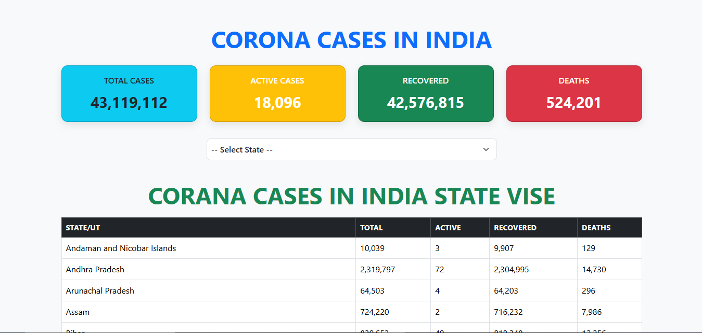
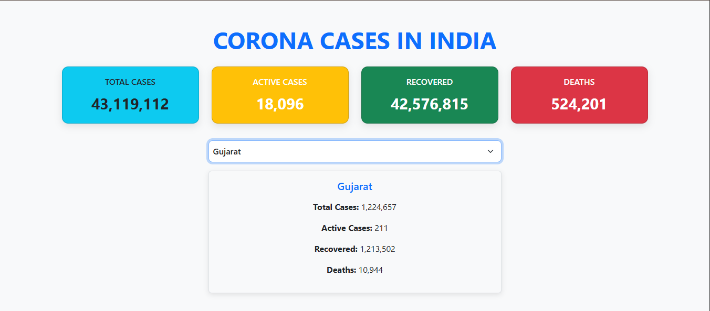

<-----  CORONA API  ----->

Link here:-

Output:-
1. Corona Cases



2. Perticulary State



## Description
This project is a simple web application that uses a public Corona (COVID-19) API to fetch and display real-time COVID-19 statistics. It provides users with up-to-date information about cases, recoveries, and deaths.

## Features
- Fetches real-time COVID-19 data from a public API
- Displays statistics in a user-friendly format
- Responsive and clean UI

## Technology Used
- HTML, CSS, JavaScript (Vanilla JS)
- Fetch API for making HTTP requests
- Vercel for Deployment

## Folder Structure
```
index.html        # Main HTML file
style.css         # Stylesheet for the app
script.js         # JavaScript logic for fetching and displaying data
output/           # Contains generated images or charts
    1.png
    2.png
readme.md         # Project documentation
```


